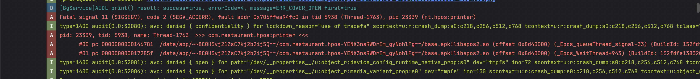

For the Epson printer crash issue, I’ve created a separate account and prepared all the necessary configuration settings. After you install the POS APK, we will provide the login code (the login PIN is 1). You will need to provide me with the IP address of your local impact printer so I can configure it. The model we are currently using is U220.

I’ve included a video demonstrating how to operate the POS and perform printing. The screenshot below shows the crash error we encountered today.

The steps in the video show how to trigger the print action. - https://github.com/LeoLeoLeoLei/EpsonImpactPrinterWithHWAsan/blob/main/demo.mp4

This crash occurs intermittently. In our development environment, we were able to reproduce it after testing for around 10–20 minutes.

I uploaded a tombstone file; you can refer to the logs inside. 